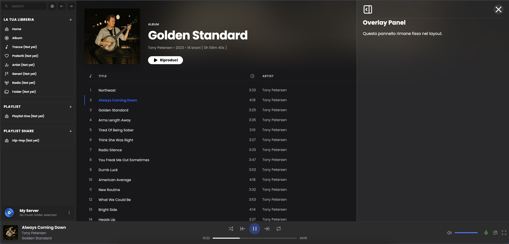
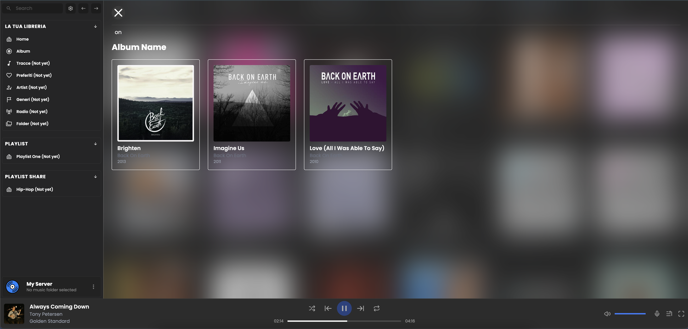

# Velvet — Navidrome / Subsonic Client

This web app is built with React and is heavily inspired by other PWA clients.

If you are looking for something ready to use, this app is probably **not for you**.  
However, if you want to build and customize your own PWA client, this project can be a good starting point.

| Pages | Status |
| --- | --- |
| Home | Almost completed |
| Album | **Finished** |
| Tracks | Not started |
| Favorites | Not started |
| Artist | Not started |
| Genre | Currently in development |
| Radio | Not started |
| Folder | Not started |
---
# Screenshot:
<table>
<tr>
<td></td>
<td></td>
</tr>
<tr>
<td></td>
<td></td>
</tr>
</table>

# Credits:
Velvet App is heavily inspired by these projects:
- Feishn: https://github.com/jeffvli/feishin.git
- Monochrome: https://github.com/monochrome-music/monochrome.git
- Login Animation from @ssebastianoo: https://github.com/ssebastianoo/html-3d-plane.git